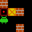

# Reinforcement Learning for Computer Game playing

**Authors:** Tom LABIAUSSE & Nicolas FABRIGOULE

**Date:** 2023/2024

## 0 - Setup

* Clone the repository:
```bash
git clone git@github.com:t0m1ab/CS3A_RL_project.git
```

* Install `cs3arl` as a package in edit mode (see config in `pyproject.toml`): 
```bash
cd CS3A_RL_project/
pip install -e .
``` 

* Test the installation using the newly declared command `cs3arl`: 
```bash
cs3arl --test
``` 

## 1 - Sokoban environment and visualization tools

* The folder [sokoban](./cs3arl/sokoban/) contains all the code required to define a Sokoban environment respecting the Gym API and interacting with it through a Gradio UI. It also contains maps as for example a subset of [DeepMind boxoban levels](https://github.com/google-deepmind/boxoban-levels).

## 2 - Learn to solve Sokoban using classic RL methods

* The folder [classicrl](./cs3arl/classicrl/) contains all the code required to train an agent to solve Sokoban maps using different RL methods like MC Exploring Starts, Temporal Difference Learning, Q-learning...
* Launch a training with the following command:
```bash
python games/sokoban_Q_Learning.py
```

## 3 - Learn to solve Sokoban using deep RL methods

* The folder [deeprl](./cs3arl/deeprl/) contains all the code required to train an agent to solve Sokoban maps using Deep Q-learning.
* Launch a training with the following command:
```bash
python games/sokoban_DQN.py
```

